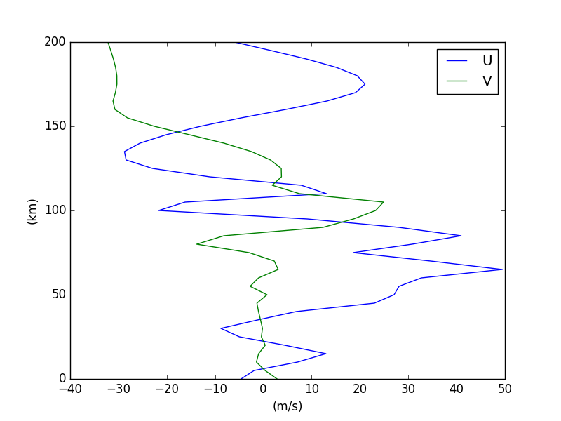
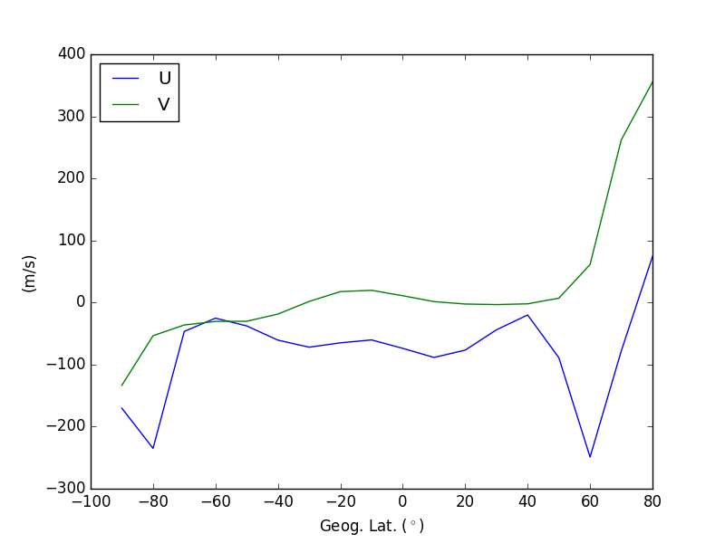
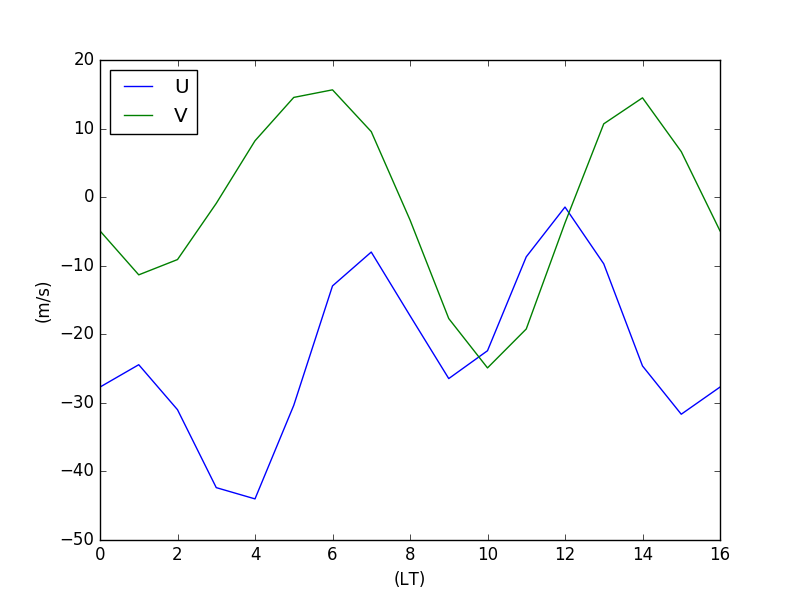
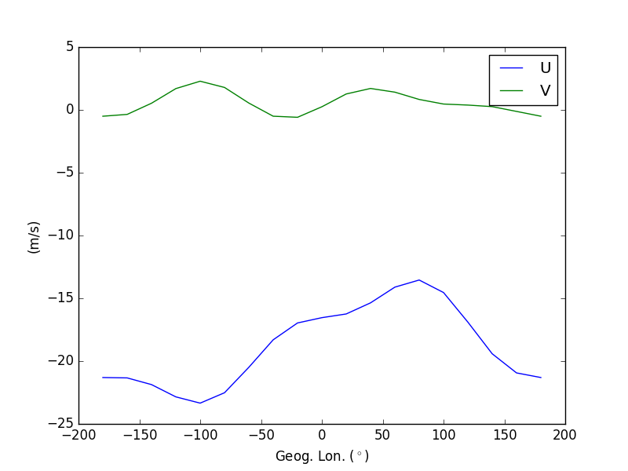
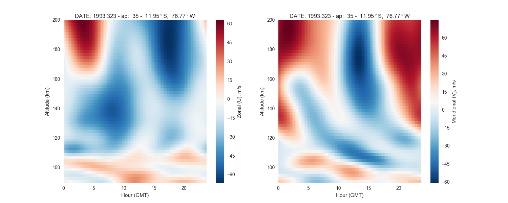
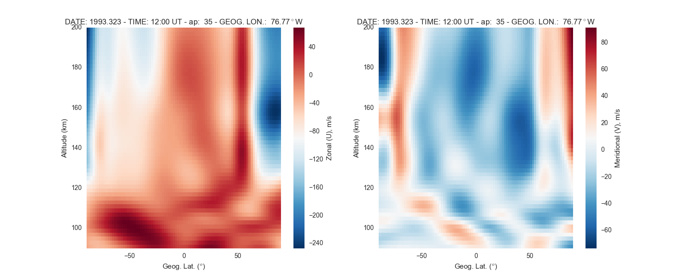
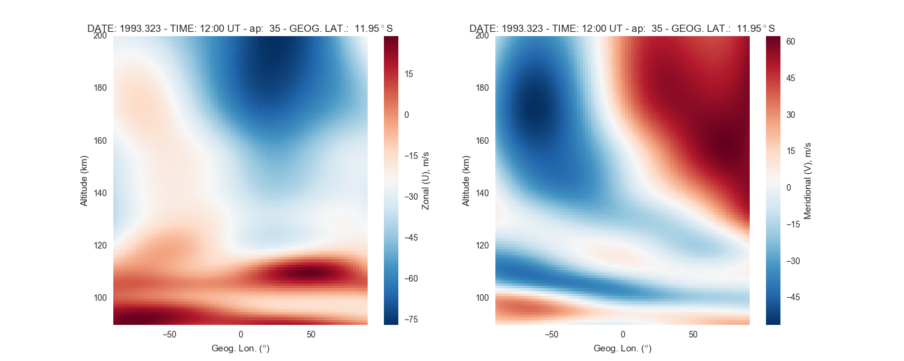
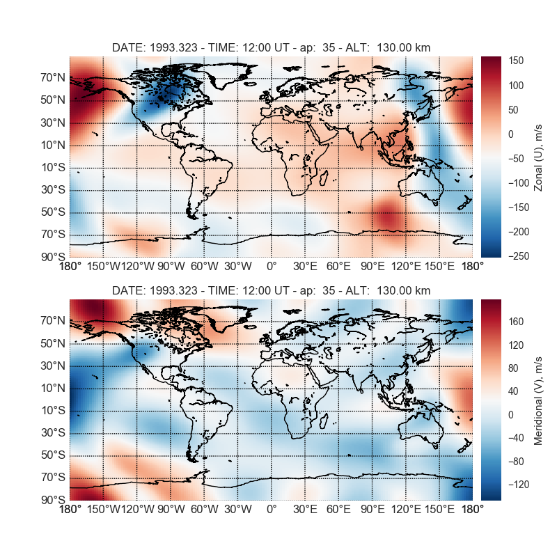
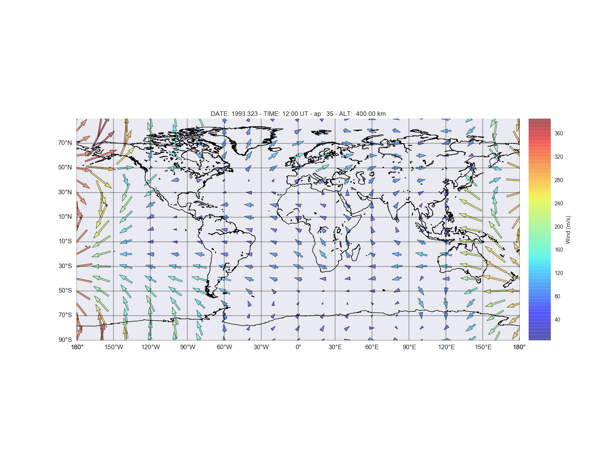

.. image:: https://travis-ci.org/rilma/pyHWM14.svg?branch=master
    :target: https://travis-ci.org/rilma/pyHWM14
.. image:: https://zenodo.org/badge/DOI/10.5281/zenodo.240890.svg
   :target: http://doi.org/10.5281/zenodo.240890
   
=======
pyHWM14
=======
Python interface for the Horizontal Wind Model version 2014 (HWM14)

.. contents::

Installation
============

----------------
From Source Code
----------------

.. code-block:: bash

    $ git clone https://github.com/rilma/pyHWM14.git
    $ cd pyHWM14
    $ pip -q install coveralls
    $ pip install numpy
    $ pip install -e . --process-dependency-links

-------
Testing
-------

.. code-block:: bash

    $ coverage run tests/test.py -v

---------
From PyPi
---------

::

    pip install pyhwm2014

Examples
========

You will need seaborn (the statistical data visualization package) in order to run the following examples.

.. code-block:: bash

    $ pip install seaborn

--------------
Height Profile
--------------

.. code-block:: bash

    >>> from pyhwm2014 import HWM14, HWM14Plot    
    >>> hwm14Obj = HWM14( altlim=[90,200], altstp=1, ap=[-1, 35], day=323,
            option=1, ut=11.66667, verbose=False, year=1993 )            
    >>> hwm14Gbj = HWM14Plot( profObj=hwm14Obj )
    
    

You can also list the values on screen as follows

.. code-block:: bash

    >>> from pyhwm2014 import HWM14
    >>> hwm14Obj = HWM14( altlim=[90,200], altstp=10, ap=[-1, 35], day=323,
            option=1, ut=11.66667, verbose=True, year=1993 )
    
    HEIGHT PROFILE
                     quiet         disturbed             total
     alt      mer      zon      mer      zon      mer      zon
      90   11.112   28.727   -0.001   -0.000   11.112   28.726
     100   26.762    6.705   -0.007   -0.006   26.755    6.700
     110  -40.361    1.468   -0.080   -0.066  -40.442    1.402
     120  -15.063  -16.198   -0.777   -0.640  -15.840  -16.838
     130    5.352  -28.597   -2.713   -2.233    2.639  -30.829
     140   -7.310  -28.295   -3.410   -2.806  -10.720  -31.101
     150  -23.281  -26.597   -3.484   -2.867  -26.765  -29.464
     160  -34.557  -20.983   -3.490   -2.872  -38.047  -23.855
     170  -40.041  -13.405   -3.491   -2.872  -43.531  -16.277
     180  -37.589  -12.893   -3.491   -2.872  -41.080  -15.765
     190  -29.611  -18.405   -3.491   -2.872  -33.102  -21.278
     200  -19.680  -26.278   -3.491   -2.872  -23.171  -29.150

----------------------
Geog. Latitude Profile
----------------------

.. code-block:: bash
    
    >>> from pyhwm2014 import HWM14, HWM14Plot
    >>> hwm14Obj = HWM14( alt=130., ap=[-1, 35], day=323, glatlim=[-90.,90.],
            glatstp=1., option=2, ut=11.66667, verbose=False, year=1993 )            
    >>> hwm14Gbj = HWM14Plot( profObj=hwm14Obj )
    
        

------------------
GMT Profile
------------------

.. code-block:: bash

    >>> from pyhwm2014 import HWM14, HWM14Plot
    >>> hwm14Obj = HWM14( alt=130., ap=[-1, 35], day=323,
            option=3, utlim=[0., 23.45], utstp=.25, verbose=False, year=1993 )            
    >>> hwm14Gbj = HWM14Plot( profObj=hwm14Obj )
    

-----------------------
Geog. Longitude Profile
-----------------------

.. code-block:: bash

    >>> from pyhwm2014 import HWM14, HWM14Plot
    >>> hwm14Obj = HWM14( alt=130., ap=[-1, 35], day=323, glonlim=[-180., 180.], glonstp=2.,
            option=4, verbose=False, year=1993 )            
    >>> hwm14Gbj = HWM14Plot( profObj=hwm14Obj )

-----------------------
Height vs GMT
-----------------------

.. code-block:: bash

    >>> from pyhwm2014 import HWM142D, HWM142DPlot
    >>> hwm14Obj = HWM142D(altlim=[90,200], altstp=2, ap=[-1, 35], 
            option=1, utlim=[0.,23.75], utstp=.25, verbose=False)
    >>> hwm14Gbj = HWM142DPlot(profObj=hwm14Obj, zMin=[-75., -100], zMax=[75., 100.])

-------------------------
Height vs Geog. Latitude
-------------------------

.. code-block:: bash

    >>> from pyhwm2014 import HWM142D, HWM142DPlot
    >>> hwm14Obj = HWM142D(altlim=[90., 200.], altstp=2., ap=[-1, 35], 
            glatlim=[-90., 90.], glatstp=2., option=2, verbose=False, ut=12.)            
    >>> hwm14Gbj = HWM142DPlot(profObj=hwm14Obj, zMin=[-250., -100], zMax=[250., 100.])

-------------------------
Height vs Geog. Longitude
-------------------------

.. code-block:: bash

    >>> from pyhwm2014 import HWM142D, HWM142DPlot
    >>> hwm14Obj = HWM142D(altlim=[90., 200.], altstp=1., ap=[-1, 35], 
            glonlim=[-90., 90.], glonstp=2., option=4, ut=12., verbose=False)            
    >>> hwm14Gbj = HWM142DPlot(profObj=hwm14Obj, zMin=[-100., -100], zMax=[100., 100.])

----------------------------------
Geog. Latitude vs Geog. Longitude
----------------------------------

.. code-block:: bash

    >>> from pyhwm2014 import HWM142D, HWM142DPlot
    >>> hwm14Obj = HWM142D(alt=130., ap=[-1, 35], glatlim=[-90., 90.], 
            glatstp=1., glonlim=[-180., 180.], glonstp=2., option=6, verbose=False)
    >>> hwm14Gbj = HWM142DPlot(profObj=hwm14Obj, zMin=[-150., -150], zMax=[150., 150.])

----------------------------------
Horizontal Wind Field Map 
----------------------------------

.. code-block:: bash

    >>> from pyhwm2014 import HWM142D, HWM142DPlot
    >>> hwm14Obj = HWM142D(alt=400., ap=[-1, 35], glatlim=[-90., 90.], glatstp=10., 
            glonlim=[-180., 180.], glonstp=20., option=6, verbose=False)
    >>> hwm14Gbj = HWM142DPlot( profObj=hwm14Obj, WF=True, zMin=[-150., -150], 
            zMax=[150., 150.] )
    

References
==========

.. [1] Peterson, P. `"F2PY: Fortran to Python interface generator" <https://sysbio.ioc.ee/projects/f2py2e/>`_

.. [2] Drob, D. P. et al. `"An update to the Horizontal Wind Model (HWM): The quiet time thermosphere", Earth and Space Science, 2015 <http://onlinelibrary.wiley.com/doi/10.1002/2014EA000089/full>`_

---------------------
Wrapping Fortran code
---------------------
This is for reference, no need to do this as it's done by  ``python setup.py develop``

1. The first step is to ask 'f2py' to write the signature of the routine (hwm14.f90) to 
a description file

.. code-block:: bash

    $ f2py hwm14.f90 -m hwm14 -h hwm14.pyf
    
The '-m' flag gives the name the python module should have (hwm14). The '-h' flag tells 
'f2py' in which file should write the signature (see file 'hwm14.pyf').

2. 'f2py' recognizes which variables need to be passed in or out. This is done by the command 
'intent' added to the declaration of variables. 

3. Now everything is ready and the module can be compiled. f2py will try to find a compiler 
in your path and use it. So all to be typed is

.. code-block:: bash

    $ f2py -c hwm14.pyf hwm14.f90

'f2py' will write the wrapper files, compile hwm14.f90 and the wrapper files, and link them 
in a shared object. After this step, one can start Python and load the extension module.

NOTE: To specify a Fortran compiler type by vendor, e.g. ifort (Intel Fortran compiler):

.. code-block:: bash

    $ f2py -c hwm14.pyf hwm14.f90 --fcompiler=intelem

